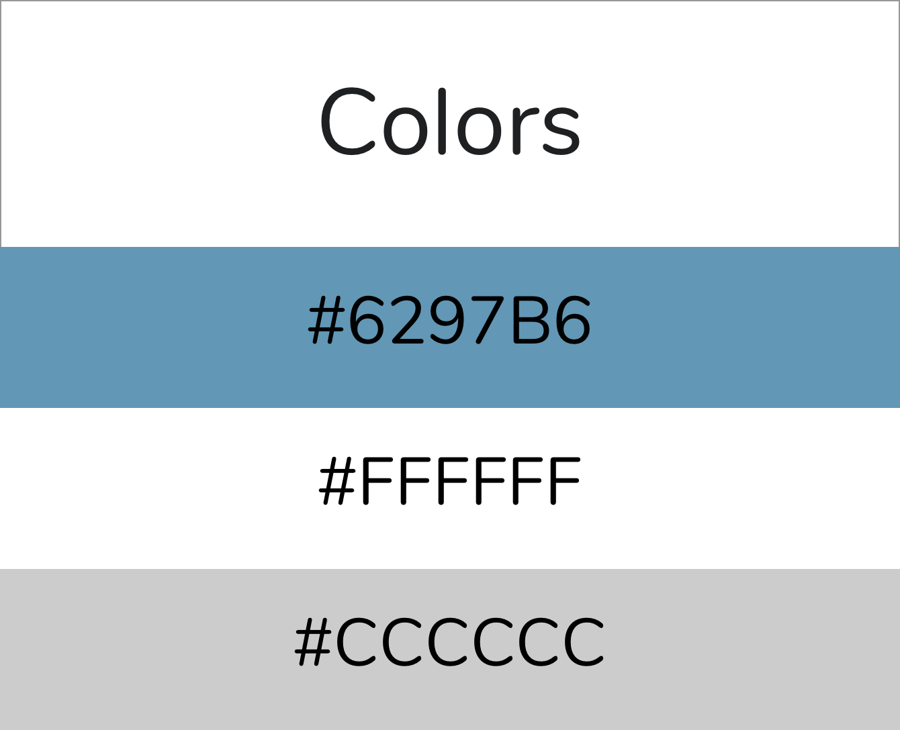
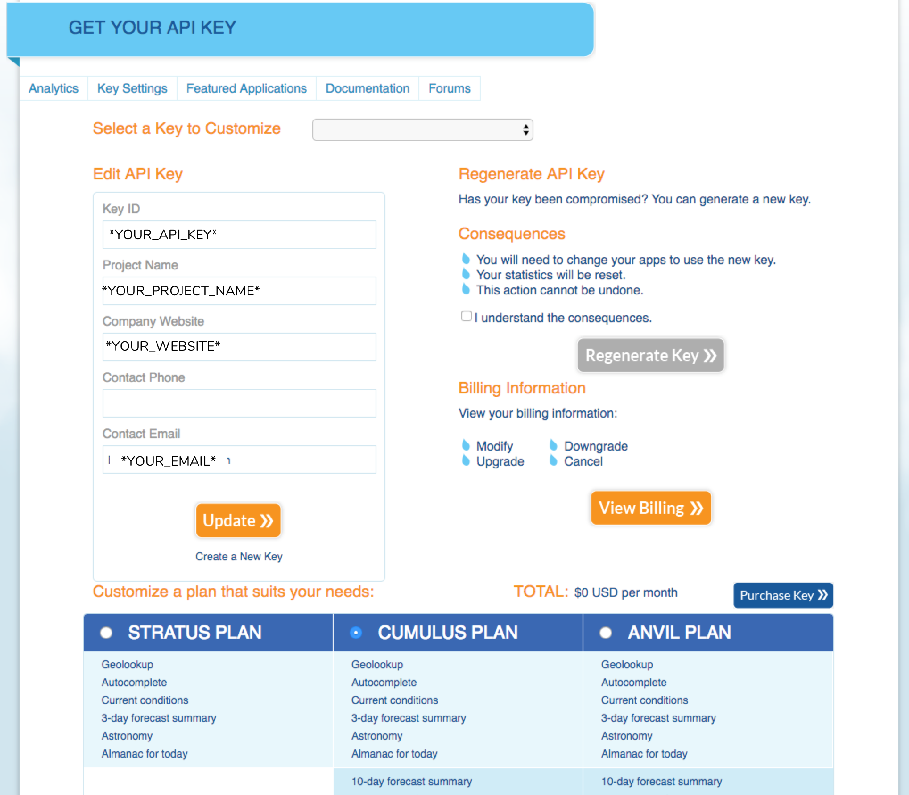
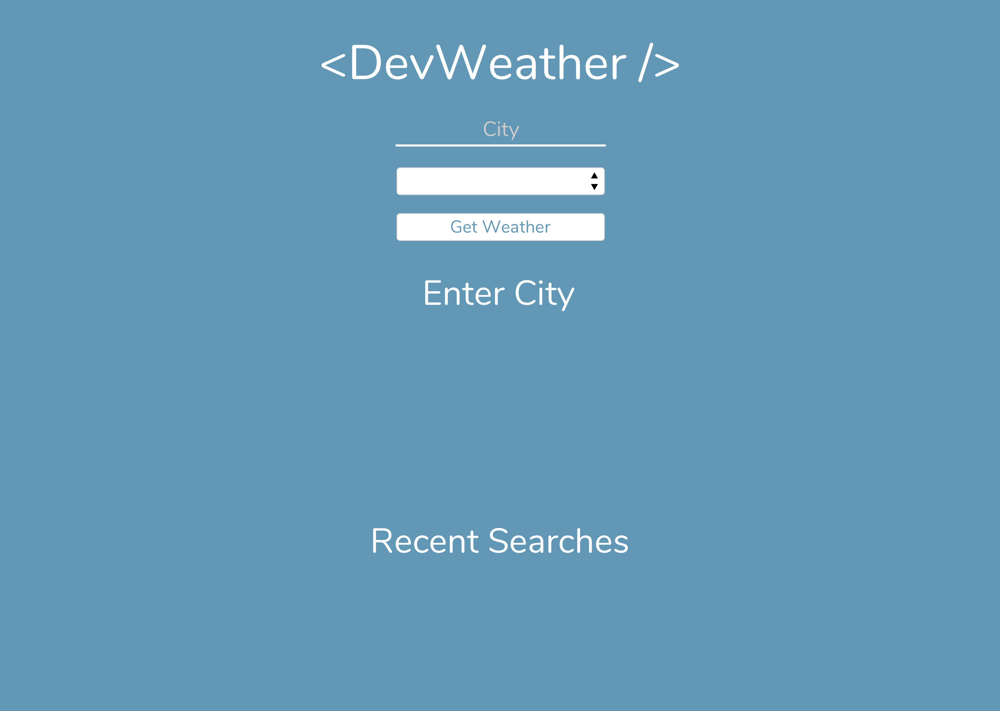
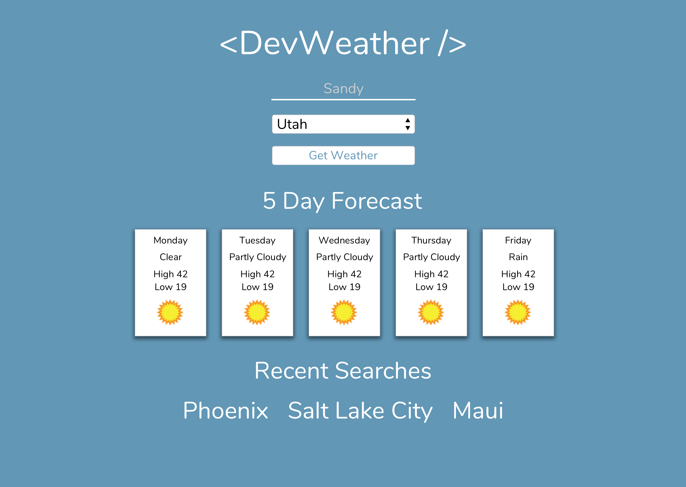

# Weather App Simulation

This project is designed to replicate what you might receive on the job. There won't be any guided instruction on what you'll need to do. We will only provide you with design specifications and technical requirements. Your mentor/instructor have also been asked to provide only minimal guidance. They can point you in the right direction, but cannot help you code. This project is a chance for you to combine and showcase the skills you've learned so far.

With this specification/requirement only structure, we believe this project will showcase what you can do as an individual. Because of this, we feel this project will be worth putting in your portfolio.

Good luck and work hard!

# Color Palette & Font

<b><a href="https://fonts.google.com/specimen/Nunito">Google Font - Nunito</a></b>

# Technical Requirements - Front-end

## API
* Go to https://www.wunderground.com/weather/api/ and click 'Sign up to get started'
* Once you have signed in, go to your dashboard and click 'Key Settings'. Here is where you will generate a new API key
  * HINT: you will use `http://api.wunderground.com/api/YOUR_API_KEY/forecast10day/q/${state}/${city}.json` in your axios request to get the weather data.

## Homepage
* Recent Searches should be empty and the area where weather data by day is whould show 'Enter City'
* User should be able to enter city, select state and then submit the form to get data

## Homepage - Weather Data
* 'Enter City' should be replaced with '5 Day Forecast'
* The weather API will give you a 10 day forecast but you will have to modify the data you receive from the API to only display 5 days.
  * HINT: Modify the array of data using slice
* Recent Searches should now show a recent city, with a maximum of 3 cities.

# Technical Requirements - Back-end
* The back-end should be created using express. 
* Express.static should be used to server your front-end files.
  * HINT: Use `npm build` to get production ready front-end files.

## Endpoints
* GET `/api/places` - Should get the list of recent city searches
* POST `/api/places` - Should add city to the list of recently searched cities. Rember, this array should only show the three most recent cities
